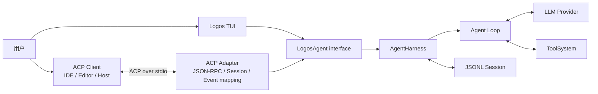
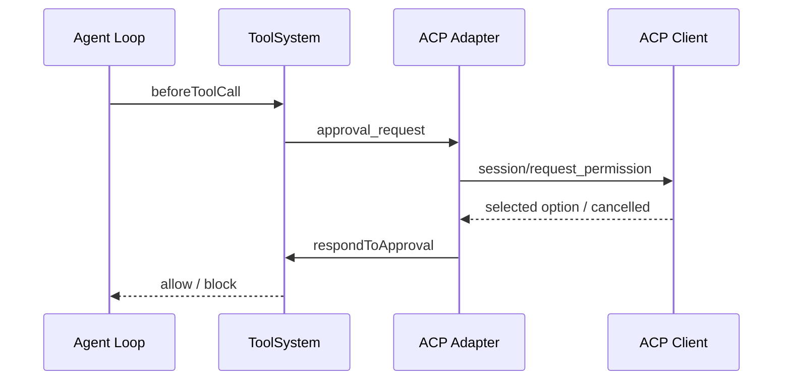

# Logos Agent ACP Adapter 设计

> 状态：仅设计，尚未实现。
>
> 本文中的 ACP 指 [Agent Client Protocol](https://agentclientprotocol.com/)。协议语义以官方 ACP v2 Draft 文档为基线；实现前必须固定支持该草案的官方 TypeScript SDK 版本，不复制协议 Schema，也不创建 Logos 私有 ACP 方言。

## 1. 结论

Logos Agent 应支持 ACP，但支持方式是增加一个外部 **ACP Adapter**，不是修改 Agent Loop、Harness 或 ToolSystem：

- TUI 与 ACP 是 `LogosAgent` interface 上的两个同级 Adapter；
- ACP Adapter 负责标准协议握手、Session 路由、事件转换、中断和用户交互；
- `AgentHarness` 继续负责 Turn、Session、Context、中断和运行时事件；
- Agent Loop 继续负责 Provider 与工具执行循环；
- ToolSystem 继续负责工具权限、审批、审计和结果治理；
- ACP Adapter 不直接调用 Provider，不执行工具，也不接触 Provider Context；
- 现有 coding-agent JSONL RPC 只作实现经验参考，不放在 ACP 与 Logos Agent 之间。

一句话定位：

```text
ACP 让外部客户端能够使用 Logos Agent，但不改变 Logos Agent 如何思考和执行。
```

## 2. 为什么需要 ACP

当前 Logos Agent 只能由自己的 TUI 驱动。这个形态适合学习和本地验证，但外部编辑器如果要接入，需要理解 Logos 私有事件、Session 和审批协议。

ACP 提供标准的 Agent/Client 协议，覆盖：

- 初始化和能力协商；
- 创建、恢复、列出和关闭 Session；
- 提交 Prompt 和流式接收内容；
- 工具调用状态与结果更新；
- 权限请求；
- 中断；
- 可选的结构化询问、文件系统和 Terminal 能力。

支持 ACP 后，编辑器或其他客户端只需要理解 ACP，不需要依赖 Logos TUI。

如果 Logos Agent 永远只作为自己的 TUI 运行，则 ACP 没有必要。只要目标包含 IDE 接入、第三方前端或标准化 Agent 调用，ACP Adapter 就有明确价值。

## 3. 在整体架构中的位置



依赖方向必须保持单向：

```text
ACP Adapter -> LogosAgent -> AgentHarness -> Agent Loop
                                  |
                                  +-> ToolSystem
```

禁止出现：

```text
AgentHarness -> ACP
ToolSystem -> ACP
Agent Loop -> ACP
```

Harness、ToolSystem 和 Agent Loop 不应知道当前调用者是 TUI 还是 ACP Client。

## 4. 为什么不直接复用现有 JSONL RPC

`packages/coding-agent` 已有 headless JSONL RPC，包含 prompt、abort、Session、模型、压缩和事件流。这证明当前运行时可以被无 TUI 驱动，但它不是 ACP：

| 方面 | coding-agent JSONL RPC | ACP |
|---|---|---|
| 消息封装 | 自定义 JSON line | JSON-RPC 2.0 |
| 初始化 | 进程启动后直接收命令 | `initialize` 版本与能力协商 |
| Session | 私有命令 | 标准 Session 方法 |
| 事件 | 直接输出内部事件 | 标准 `session/update` |
| 权限 | extension UI 私有请求 | `session/request_permission` |
| 工具展示 | 客户端理解内部事件 | 标准 tool call update |
| 兼容性 | 仅自有客户端 | ACP Client |

不采用以下链路：

```text
ACP Client -> ACP 翻译 -> coding-agent RPC -> Logos Agent
```

原因：

- Logos Agent 不以 coding-agent `AgentSession` 为核心；
- 两层 wire protocol 会重复维护请求 ID、错误、取消和事件；
- 内部事件会先转换成私有 RPC，再转换成 ACP，丢失语义且增加故障点；
- 删除中间 RPC 后，复杂度不会扩散到其他模块，说明这一层没有必要。

可以复用的是处理经验，例如 stdout 隔离、JSONL 背压、信号退出和异步 Prompt 接收，不复用私有消息结构。

## 5. 运行时 seam

ACP Adapter 只通过 `LogosAgent` interface 驱动 Agent。大部分运行能力已经存在，但 ACP v2 的 Prompt 接受语义还缺一个明确 seam：`prompt()` 返回时整个 Turn 已结束，不能把这个 Promise 直接作为 `session/prompt` 的接受响应。

| ACP 所需行为 | `LogosAgent` 能力 |
|---|---|
| 原子接受 Prompt | 尚缺；Phase 1 增加最小的通用 start seam，向 Adapter 返回 Agent 拥有的 message ID 与 completion handle |
| 执行 Prompt 与等待结束 | `prompt()` / `subscribe()` / `waitForIdle()` |
| 中途指导 | `steer()` |
| 中断 | `abort()` |
| 等待空闲 | `waitForIdle()` |
| 事件流 | `subscribe()` |
| 审批响应 | `respondToApproval()` |
| 结构化问题响应 | `respondToQuestion()` |
| 新建 Session | `newSession()` |
| 列出 Session | `listSessions()` |
| 恢复 Session | `switchSession()` |
| 关闭实例 | `shutdown()` |

ACP Adapter 不订阅 Harness 私有对象，也不从 Session 文件反向推导运行状态。Prompt start seam 必须原子地完成 busy 校验、用户消息入队和 message ID 分配，然后立即返回；Turn 完成仍通过事件和 completion handle 报告。这个 seam 表达通用的 Agent 生命周期，不包含 ACP 类型，也不要求修改 Harness 或 Agent Loop。其他缺口只有在确属通用运行时行为时才扩展 `LogosAgent` interface。

## 6. ACP 方法映射

首个可用版本实现以下方法：

| ACP 方法 | Logos 行为 |
|---|---|
| `initialize` | 返回协议版本、Agent 信息和实际支持的能力 |
| `session/new` | 为绝对 `cwd` 创建隔离的 Logos Agent Session |
| `session/list` | 投影 `listSessions()` 的安全摘要 |
| `session/resume` | 打开持久化 Session，并按需回放历史 |
| `session/close` | 中断活动 Turn，释放该 Session 的 Agent 实例 |
| `session/prompt` | 将 ACP content blocks 转成用户输入，通过 start seam 原子接受后立即返回空结果 |
| `session/cancel` | 调用对应 Session 的 `abort()` |

首个版本不返回 `authMethods`，因此不实现 `auth/login` 和 `auth/logout`。以后只有出现真实远程身份需求时才增加认证 Adapter。

`session/prompt` 的 ACP 响应保持草案规定的空结果，只表达 Agent 已接受 Prompt，不返回内部 handle，也不等待 Prompt 生命周期结束。Adapter 使用 start seam 返回的 message ID 发送随后的 `user_message` update，并使用 completion handle 结算错误；running、文本、thinking、工具和最终 idle/stop reason 都通过 `session/update` 发送。

## 7. 事件映射

事件转换集中在 ACP Adapter 内部的 event mapper。它只消费 `LogosAgentUiEvent`，不把 ACP 类型泄漏回 Agent。

| Logos 事件 | ACP 输出 |
|---|---|
| `agent_start` / `turn_start` | foreground state 变为 working |
| assistant `message_update` text delta | Agent message content chunk |
| assistant `message_update` thinking delta | Agent thought content chunk；客户端不支持时不发送 |
| `tool_execution_start` | tool call，状态 `pending` 或 `in_progress` |
| `tool_execution_update` | 只发送 Adapter 生成的有界状态摘要；不能原样转发当前 `partialResult` |
| `tool_execution_end` | tool call update，状态 `completed` 或 `failed` |
| `approval_request` | 调用 Client 的 `session/request_permission` |
| `approval_resolved` | 更新对应 tool call 的审批状态 |
| `question_request` | Phase 1 安全取消；Phase 2 在客户端支持时调用 `elicitation/create` |
| `agent_end` / settled | foreground state 变为 idle，并给出 stop reason |

以下内部事件默认不发送给 ACP Client：

- Provider Payload；
- Context 完整快照；
- ToolSystem 原始审计内容；
- Session 文件路径；
- Provider 凭据和配置；
- 未经治理的 ToolResult；
- Logos 内部 continuation、reflection 和 cache 细节。

当前 ToolSystem 只统一治理最终 ToolResult，Harness 的 `partialResult` 不是已治理内容。首版 Adapter 因此只从工具名、状态和已批准的展示元数据生成进度；最终内容只能投影治理后的 ToolResult。将来若需要丰富的流式进度，应先增加 ToolSystem 通用 progress projection seam，不能在 ACP Adapter 中信任原始进度。

这些信息继续进入 Observability。将来确有客户端诊断需求时，只能通过 ACP `_meta` 或 `_logos/*` 扩展发送有界摘要，不能修改标准字段语义。

## 8. Session 隔离

ACP 连接可能同时管理多个 Session，而当前 TUI 只有一个活动 `LogosAgent` 实例。ACP Adapter 内部需要一个 Session registry：

```text
ACP sessionId -> 独立 LogosAgent 实例 -> 独立 Harness / Session / AbortSignal
```

规则：

- 每个 ACP Session 拥有独立的 Agent 实例和事件订阅；
- 同一 Session 同时只运行一个 foreground Prompt；
- 不同 Session 不共享 approval、question、abort 或事件队列；
- `session/cancel` 只中断目标 Session；
- `session/close` 先中断，再等待 settled，最后调用 `shutdown()`；
- Session registry 是 ACP Adapter 的内部实现，不进入 Harness；
- persisted Logos session ID 与 ACP session ID 通过 registry 显式映射，不依赖字符串相同；
- 进程退出时统一关闭所有 Agent 实例。

这样可以避免通过不断 `switchSession()` 复用一个全局实例造成并发串线。

## 9. Workspace 与文件路径

ACP 协议中的文件路径使用绝对路径。Logos Agent 应保持以下语义：

- `session/new` 的 `cwd` 必须是规范化后的绝对本地目录；
- cwd 必须满足进程启动时注入的 workspace policy；
- cwd 成为该 Session 的 `workspaceRoot`，不是修改全局 CWD；
- 写入、Git 和命令仍受该 Session 的 workspace root 限制；
- `read_file`、`list_files` 和 `grep` 可以使用已有的显式绝对路径只读能力；
- network/UNC、敏感路径和符号链接限制保持不变；
- ACP Adapter 不自行读写文件，不绕过 ToolSystem。

### 9.1 首个版本：本地文件系统

首个版本定位为本地 ACP subprocess。Logos 工具继续使用现有 Node operations，ACP Adapter 不声明或调用 Client 的 `fs/*`、`terminal/*` 能力。

### 9.2 延后：远程或 Client 托管文件系统

当真实客户端与 Agent 不共享文件系统时，再增加 ACP-backed operations Adapter：

```text
read-only tools -> ReadOnlyWorkspaceOperations -> ACP Client fs Adapter
edit tools      -> Edit Operations             -> ACP Client fs Adapter
command tools   -> Command Operations          -> ACP Client terminal Adapter
```

届时本地 Node Adapter 和 ACP Client Adapter 满足同一个 operations interface。ToolSystem 和工具 Schema 不增加 `if acp` 分支。

没有远程工作区需求前，不提前实现 Client 文件系统和 Terminal 代理。

## 10. 权限与结构化询问

### 10.1 权限

审批仍由 ToolSystem 发起，ACP Adapter 只是另一种用户交互 Adapter：



规则：

- ACP Client 的批准不能绕过 ToolSystem；
- Adapter 只能响应当前 Session 中仍待处理的 request ID；
- `session/cancel` 必须把待处理权限请求结算为 cancelled；
- Client 断开不能被解释为批准；
- 审批文本继续使用 ToolSystem 已生成并脱敏的 `ApprovalSubject`；
- Adapter 不重新构造权限策略。

### 10.2 结构化询问

Phase 1 不实现 elicitation：收到 `question_request` 时安全取消该问题，并返回“当前 ACP Adapter 不支持结构化询问”的工具结果；模型可以在普通回复中向用户提问。Phase 2 才在客户端声明支持时把 `question_request` 映射为 `elicitation/create`。

不创建 ACP 专用的第二套 `ask_user` 工具。

## 11. Transport 与进程边界

首个版本只支持官方 SDK 提供的 stdio transport：

- stdin/stdout 只承载 ACP JSON-RPC；
- 日志、诊断和崩溃信息只能写 stderr 或 Observability；
- 使用官方 TypeScript SDK 的类型和运行时，不复制协议 Schema；
- stdout 必须处理背压，不能无限缓存事件；
- 收到 EOF、SIGTERM 或 transport close 时执行统一 shutdown；
- 取消使用现有 `AbortSignal` 链路，不杀死整个进程；
- 每个请求 ID 只完成一次；notification 不返回 response；
- 未知非扩展方法返回标准 JSON-RPC method-not-found；
- 不在首个版本增加 WebSocket、HTTP 或自定义 socket。

建议使用独立入口 `logos-agent-acp`，避免 TUI 初始化、ANSI 输出或启动提示污染 stdout。它与 `logos-agent` TUI 复用同一个 Agent composition factory。

## 12. 错误和中断语义

| 场景 | 行为 |
|---|---|
| ACP 参数无效 | 返回标准 JSON-RPC invalid-params |
| Session 不存在 | 返回 Session 级错误，不创建隐式 Session |
| Session 正忙 | 按协议语义排队或拒绝；首版选择明确拒绝，不静默混入当前 Prompt |
| 普通工具失败 | 发送 failed tool update；Agent Loop 按现有规则继续 |
| Provider 临时错误 | 由现有 Provider 重试策略处理 |
| Provider 重试耗尽 | 发送错误状态并使 Session 回到 idle |
| 用户取消 | 调用 `abort()`，结算权限和 elicitation 请求，等待 settled |
| Client 断开 | 中断该连接管理的活动 Turn并关闭实例 |
| Adapter 转换失败 | 记录诊断，终止当前 Prompt，不伪造 assistant 内容 |

ACP Adapter 不吞掉 Agent 错误，也不把 transport 断开解释为工具或远端业务操作已取消。

## 13. Context、Session 与 Observability

ACP 不改变模型 Context：

```text
ACP Prompt -> LogosAgent start seam -> Harness -> ContextManager -> Provider
```

- ACP JSON-RPC envelope 不进入 Agent Message；
- Client capability、request ID 和 transport 状态不进入 Provider Context；
- 只有用户实际 content blocks 被转换为 Agent Message；
- ToolResult 仍先经过 ToolSystem 治理，再写 Session 和进入后续 Context；
- ACP event mapper 只负责展示投影，不生成第二份模型消息；
- Session 仍保存规范 Agent Message，不保存完整 ACP wire log。

Observability 建议增加 transport 层 span 或安全属性：

- ACP protocol version；
- method；
- session ID 的稳定摘要；
- request duration；
- update count 和 bytes；
- permission outcome；
- cancel、disconnect 和 error category。

不得记录 Prompt 正文、文件内容、ToolResult 正文、凭据或完整 Session 路径。是否通过 `_meta` 向 Client 暴露 trace ID，等待真实诊断需求后决定。

## 14. 建议仓库结构

实现阶段建议保持小范围：

```text
apps/logos-agent/src/acp/
  acp-entry.ts
  acp-server.ts
  acp-event-mapper.ts
  acp-session-registry.ts

apps/logos-agent/test/acp/
  acp-server.test.ts
  acp-event-mapper.test.ts
  acp-session-lifecycle.test.ts
```

职责：

- `acp-entry.ts`：stdio、进程信号和 composition；
- `acp-server.ts`：官方 ACP 方法实现；
- `acp-event-mapper.ts`：`LogosAgentUiEvent` 到 ACP update 的纯转换；
- `acp-session-registry.ts`：Session ID、Agent 实例和 pending 交互隔离。

不增加 `AcpHarness`、`AcpToolSystem`、`AcpAgentLoop` 或通用 transport framework。

## 15. 测试策略

### 15.1 Event mapper

使用普通对象输入，验证：

- text/thinking delta；
- tool pending、running、completed、failed；
- 审批和 idle 状态；
- 未治理的内部事件不会输出；
- 文本与路径保持有界和脱敏。

### 15.2 ACP server

注入 fake `LogosAgent` factory 和内存 transport，验证：

- initialize 能力与实际实现一致；
- new/list/resume/close；
- prompt/update/final response 顺序；
- cancel 只影响目标 Session；
- 权限 request/response 相关性；
- Client 断开与 shutdown；
- stdout 不包含非协议文本。

### 15.3 Agent flow

使用 Faux Provider 覆盖少量完整流程：

```text
session/new -> prompt -> tool call -> permission -> tool result -> final -> idle
```

不调用真实 Provider，不使用真实凭据。实现完成后运行官方 ACP conformance 测试；通过前不声明完整 ACP conformance。

## 16. 分阶段落地

### Phase 0：协议固定与测试样例

- 明确 ACP v2 仍是 Draft，固定具体协议草案与支持它的官方 SDK 版本；
- 保存 initialize、Session、Prompt、tool update、permission 和 cancel 的协议样例；
- 确认一个真实 ACP Client 作为首个兼容目标；
- 不写 Harness 或 ToolSystem 代码。

### Phase 1：本地可用 ACP Agent

- stdio transport；
- initialize；
- Session new/list/resume/close；
- prompt/cancel；
- text、thinking 和 tool update；
- ToolSystem permission round-trip；
- 独立 `logos-agent-acp` 入口。

### Phase 2：结构化交互和完整兼容

- elicitation；
- commands/config updates，只实现 Logos 确实拥有的能力；
- 官方 conformance 测试；
- 一个真实编辑器的端到端验证。

### Phase 3：由真实场景决定

只有实际需求出现后再评估：

- Client 托管文件系统；
- ACP Terminal；
- remote transport；
- auth；
- `_meta` trace link；
- 多 Client 共享持久 Session。

## 17. 明确不做

首个版本不做：

- 修改 Agent Loop；
- 修改 Harness 以理解 ACP；
- 在 ToolSystem 中加入 ACP 判断；
- ACP 到私有 RPC 的双层翻译；
- 复制官方 Schema 或自行维护协议类型；
- WebSocket/HTTP Server；
- 远程认证；
- Client 文件系统和 Terminal 代理；
- 把 Context Trace 或完整审计发送给 Client；
- ACP 专用 Session 格式；
- ACP 专用工具或权限系统；
- 为未来协议能力预建通用框架。

## 18. 验收标准

Phase 1 完成时应满足：

1. TUI 行为不受 ACP 影响；
2. Harness、Agent Loop 和 ToolSystem 不包含 ACP 名称或分支；
3. ACP Adapter 只通过 `LogosAgent` interface 驱动运行时；
4. stdout 只包含合法 ACP JSON-RPC；
5. 每个 ACP Session 的消息、审批、中断和事件相互隔离；
6. ToolResult 在发送给 Client 前已经经过 ToolSystem 治理；
7. Client 断开和取消不会被解释为工具或远端业务操作已取消；
8. Session、Prompt、工具、审批和 cancel 流程有自动化测试；
9. 不使用真实 Provider 或凭据运行协议测试；
10. 官方 conformance 测试通过后才声明对应版本兼容。

## 19. 最终判断

ACP 是 Logos Agent 的标准外壳，不是新的运行内核：

```text
ACP Adapter 负责“外部客户端如何和 Agent 说话”。
LogosAgent 负责“一个 Agent 实例能做什么”。
Harness 负责“Agent 如何稳定运行”。
Agent Loop 负责“模型和工具如何循环”。
ToolSystem 负责“工具如何被安全治理”。
```

删除 ACP Adapter 后，TUI、Harness、Agent Loop 和 ToolSystem 仍应完整运行；增加另一个客户端 Adapter 时，也不应修改 Agent 内核。这是该 seam 是否正确的最终检验。
