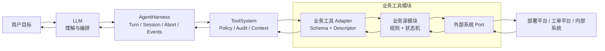
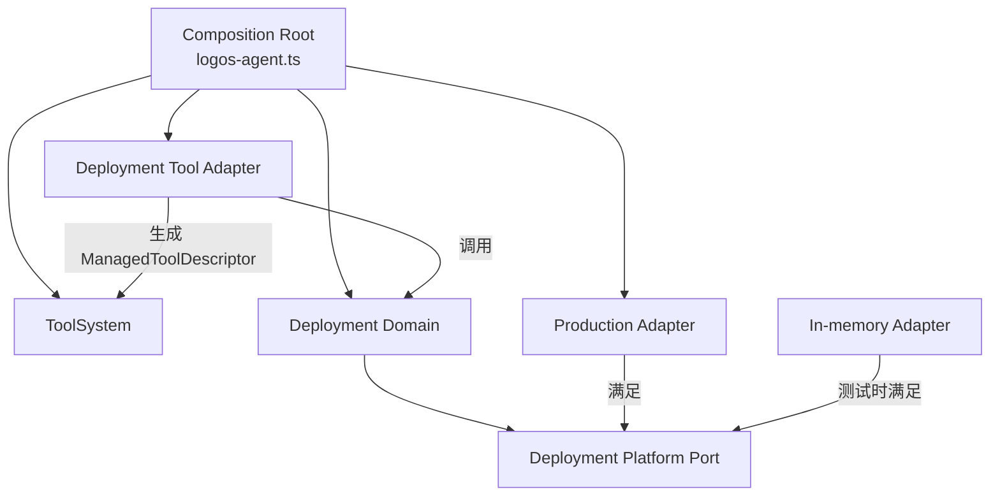
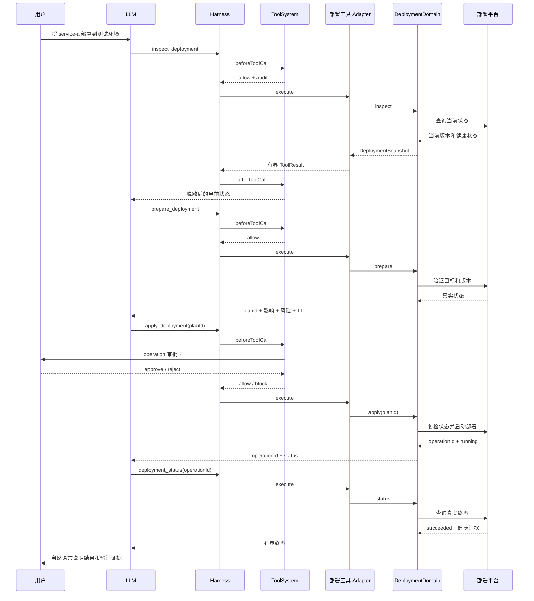

# Logos Agent 业务工具模块设计

> 状态：设计稿，尚未实现。
>
> 本文定义部署、工单、用户任务等业务能力如何接入 Logos Agent。它不改变 Agent Loop，不把业务逻辑加入 Harness，也不引入新的工具基类或插件运行时。

## 1. 结论

业务能力应作为 **业务工具模块** 接入现有 `ToolSystem`：

- `AgentHarness` 继续负责 Turn、Session、Context seam、中断和事件；
- `ToolSystem` 继续负责工具注册、权限、审批、审计、结果治理和模型指导；
- 业务工具 Adapter 把模型工具协议转换成业务模块调用；
- 业务深模块负责业务规则、状态机、幂等和并发校验；
- 外部 Adapter 负责连接部署平台、工单平台或内部系统。

`ManagedToolDescriptor` 是业务能力进入工具系统的唯一 seam。Agent Loop 继续校验参数并调用 `tool.execute()`；ToolSystem 只负责注册以及调用前后的治理。新增业务工具时，Harness、Agent Loop 和 ToolSystem 的治理管道都不应出现业务名称判断。



## 2. 要解决的问题

后续业务工具会与当前文件、Git、命令工具有明显差异：

- 操作目标可能是远端业务资源，不是本地文件；
- 一次操作可能持续数分钟，当前 Provider 请求结束后仍在执行；
- 同一个动作在测试环境和生产环境具有不同风险；
- 用户批准后，目标状态仍可能在真正执行前发生变化；
- 工具可能返回大量日志、事件和业务数据；
- 凭据、租户、环境和资源范围不能交给模型决定；
- Provider 中断不代表远端业务操作已经取消。

如果每个业务工具分别处理权限、审批、审计、脱敏和 Context，会重新产生此前工具系统已经解决的分散逻辑。反过来，如果把部署或工单流程写进 Harness，Agent 的运行内核会和业务系统耦合。

设计目标是在两者之间建立稳定 seam：业务模块声明自己的能力和差异，ToolSystem 统一执行通用治理。

## 3. 设计原则

### 3.1 模型负责判断，代码负责不变量

模型负责：

- 理解用户实际目标；
- 选择合适的业务工具；
- 判断应先调查、准备、执行还是询问；
- 根据工具证据解释结果；
- 决定是否需要进一步验证。

运行时代码负责：

- 用户和 Agent 是否有权访问目标；
- 环境、租户、服务和版本是否允许操作；
- 业务计划是否过期或已经失效；
- 同一个请求是否被重复执行；
- 执行前目标状态是否仍与准备阶段一致；
- 凭据、敏感输出和审计信息是否安全；
- 工具输出是否适合进入模型 Context。

不能用提示词代替业务权限、幂等、状态校验和审批。

### 3.2 Harness 不理解业务

以下代码不应出现在 Harness 或 Agent Loop：

```typescript
if (event.toolName === "apply_deployment") {
  // 部署审批或部署状态判断
}
```

Harness 只调用 ToolSystem 的通用生命周期接口。业务工具是否存在，不改变 Harness 的行为。

### 3.3 ToolSystem 不实现业务

ToolSystem 可以理解：

- 工具；
- capability；
- `allow`、`ask`、`deny`；
- 审批主题；
- 审计摘要；
- 结果字节预算；
- Context 保留策略。

ToolSystem 不应理解：

- 什么是生产发布；
- 什么是工单完成；
- 哪个版本允许部署；
- 什么情况下应该回滚；
- 某个业务状态能否转换到另一个状态。

### 3.4 不新增空泛基类

当前 `ManagedToolDescriptor` 已经覆盖工具系统需要的声明。第一阶段不增加 `BusinessToolBase`、`ToolPlugin` 或第二套工具执行器。

业务工具使用描述符工厂函数接入：

```typescript
function createDeploymentToolDescriptors(
  domain: DeploymentDomain,
): readonly ManagedToolDescriptor<AgentTool, LogosApprovalSubject>[];
```

只有两个以上业务模块出现稳定、重复的装配逻辑后，才考虑提取更小的组合接口。

## 4. 模块关系与依赖方向



依赖规则：

1. 业务深模块不依赖 `ToolSystem`、Harness、TUI 或 Provider 类型；
2. 外部 Adapter 依赖业务 Port，不依赖模型工具 Schema；
3. 业务工具 Adapter 同时依赖业务模块和 `ManagedToolDescriptor`，负责协议转换；
4. Composition Root 负责创建 Adapter、业务模块和描述符，并注册到 ToolSystem；
5. ToolSystem 只保存描述符并执行调用前后治理，不反向依赖任何业务包；实际 `tool.execute()` 仍由 Agent Loop 调用。

业务工具 Adapter 是必要的浅 Adapter：它位于模型工具协议与业务模块接口之间。业务规则不能留在这一层。

## 5. 建议的仓库结构

第一阶段以部署能力为样板：

```text
apps/logos-agent/src/
  business/
    deployment/
      deployment-domain.ts
      deployment-tools.ts
      deployment-platform.ts
      deployment-result.ts
      adapters/
        <platform>-deployment-adapter.ts
  business-tools.ts
```

职责：

- `deployment-domain.ts`：计划、执行、状态查询、取消的业务规则；
- `deployment-tools.ts`：TypeBox Schema、AgentTool 和 ManagedToolDescriptor；
- `deployment-platform.ts`：业务模块访问外部平台的 Port；
- `deployment-result.ts`：领域结果及其模型投影；
- `adapters/`：真实平台 Adapter；
- `business-tools.ts`：根据启动配置组合已启用的业务描述符。

测试对应：

```text
apps/logos-agent/test/business/
  deployment-domain.test.ts
  deployment-tools.test.ts
  deployment-tool-system.test.ts
  deployment-agent-flow.test.ts
```

目录名仅表示建议的落点，不要求在本设计阶段创建源码占位文件。

## 6. ToolSystem 接入接口

### 6.1 描述符仍是唯一注册单位

业务模块不直接注册自己，也不持有 ToolSystem。它返回普通描述符：

```typescript
function createDeploymentToolDescriptors(
  domain: DeploymentDomain,
): readonly ManagedToolDescriptor<AgentTool, LogosApprovalSubject>[] {
  return [
    createInspectDeploymentDescriptor(domain),
    createPrepareDeploymentDescriptor(domain),
    createApplyDeploymentDescriptor(domain),
    createDeploymentStatusDescriptor(domain),
  ];
}
```

Composition Root 统一注册：

```typescript
const descriptors = [
  ...createCoreToolDescriptors(coreDependencies),
  ...createBusinessToolDescriptors(businessDependencies),
];

for (const descriptor of descriptors) {
  toolSystem.register(descriptor);
}
```

验收原则：新增一个业务工具模块时，可以新增业务代码和装配代码，但不修改 `ToolSystem.onToolCall()`、`ToolSystem.onToolResult()` 或 Harness。

### 6.2 Capability 命名

早期的 `ToolCapabilityKind` 是封闭联合类型；当前已保留核心 capability，并通过 `defineBusinessToolCapability()` 开放受校验的业务命名空间。真实业务 Adapter 尚未实现，后续增加 capability 不应再修改 ToolSystem 核心类型。

实现阶段应保留现有核心 capability，并允许受校验的业务命名空间：

```text
business.deployment.read
business.deployment.prepare
business.deployment.execute
business.deployment.cancel
business.deployment.rollback

business.task.read
business.task.create
business.task.update
business.task.complete
```

要求：

- capability 必须使用小写、点分隔的稳定名称；
- ToolSystem 只验证格式和执行权限合并，不解释名称；
- 业务工具模块导出自己的 capability 常量，避免字符串散落；
- 权限仍遵循“最严格结果生效”：`deny > ask > allow`；
- capability 名称进入审计和 System Prompt，但不得包含租户、密钥或用户输入。

业务 capability 通过 `defineBusinessToolCapability()` 校验并获得 branded string 类型，避免退化成任意字符串。新增业务 capability 不修改 ToolSystem 治理逻辑。

### 6.3 通用业务审批主题

现有 `LogosApprovalSubject` 对编辑、命令等核心工具有专用类型。不能为每种业务操作继续在 TUI 中增加：

```typescript
if (subject.kind === "deployment") {
  // 每个业务重复实现审批界面
}
```

第一阶段建议增加一个受限、通用的 operation 审批主题：

```typescript
interface OperationApprovalSubject {
  kind: "operation";
  title: string;
  action: string;
  target: string;
  facts: readonly {
    label: string;
    value: string;
  }[];
  warning?: string;
}
```

约束：

- 字段数量、单字段长度和总字节数必须有界；
- 内容在进入 TUI 前经过控制字符清理和脱敏；
- `facts` 只表达审批所需事实，不发展成通用 UI DSL；
- TUI 只实现一次 operation 卡片；
- 业务模块负责生成业务事实，ToolSystem 负责决定是否展示审批；
- 用户批准不能覆盖业务深模块的拒绝结果。

## 7. 部署业务模块样板

部署只是第一种业务能力，用于验证通用设计，不应写进 ToolSystem 名称或控制流。

### 7.1 工具集合

第一阶段只提供四个工具：

```text
inspect_deployment
prepare_deployment
apply_deployment
deployment_status
```

暂不加入取消和回滚，直到基础链路通过 Trace 和真实业务反馈验证。

职责：

- `inspect_deployment`：读取目标服务、当前版本和健康状态；
- `prepare_deployment`：验证请求并生成不可变计划；
- `apply_deployment`：只执行已准备且未过期的计划；
- `deployment_status`：查询远端操作的真实终态和关键证据。

不提供接受任意命令、URL、Header 或环境变量的万能部署工具。

### 7.2 业务模块接口示意

```typescript
interface DeploymentDomain {
  inspect(
    request: InspectDeploymentRequest,
    signal?: AbortSignal,
  ): Promise<DeploymentSnapshot>;

  prepare(
    request: PrepareDeploymentRequest,
    signal?: AbortSignal,
  ): Promise<DeploymentPlan>;

  apply(
    planId: string,
    signal?: AbortSignal,
  ): Promise<DeploymentOperation>;

  status(
    operationId: string,
    signal?: AbortSignal,
  ): Promise<DeploymentOperation>;
}
```

这是概念接口，不是最终源码。实现阶段应根据第一个真实部署平台的语义收敛字段，不能先构造覆盖所有平台的抽象。

### 7.3 计划对象

`prepare_deployment` 返回的计划至少需要：

```typescript
interface DeploymentPlan {
  planId: string;
  environment: string;
  service: string;
  fromVersion?: string;
  toVersion: string;
  expectedStateHash: string;
  expiresAt: string;
  summary: string;
  risks: readonly string[];
}
```

关键不变量：

- `planId` 由运行时生成，不能由模型指定；
- 计划绑定租户、环境、服务、版本和准备时状态；
- 计划具有短 TTL；
- `apply_deployment` 只接受 `planId`，不重复接受完整部署参数；
- 执行前重新取得真实状态并验证 `expectedStateHash`；
- 失效计划必须重新准备，不能静默更新后继续执行；
- 同一个 `planId` 的重复调用必须幂等，返回已有 `operationId` 或明确终态。

这与受控编辑的 proposal/apply 思路一致，但业务模块拥有自己的计划和状态机，不能复用文件编辑 Manager。

## 8. 一次部署的完整时序



## 9. 权限与审批

### 9.1 第一阶段权限保持简单

第一阶段不设计表达式语言或动态权限引擎：

| capability | 默认权限 | 原因 |
|---|---|---|
| `business.deployment.read` | `allow` | 只读状态查询 |
| `business.deployment.prepare` | `allow` | 只生成有界计划，不产生远端变更 |
| `business.deployment.execute` | `ask` | 产生远端业务副作用 |

如果第一个真实场景要求生产环境永远禁止，由业务深模块根据注入的环境 allowlist 拒绝，不等待模型或通用权限系统判断。

当多个业务模块反复需要“相同 capability 根据调用目标动态选择 allow/ask/deny”时，再以真实失败数据设计通用调用级策略。第一阶段不提前增加。

### 9.2 审批的准确语义

审批表示：

> 用户允许执行当前已准备计划。

审批不表示：

- 忽略平台权限；
- 忽略业务校验；
- 忽略计划过期；
- 保证远端操作成功；
- 自动批准计划发生变化后的新操作。

审批之后，业务模块仍必须重新验证计划绑定的状态。

## 10. AbortSignal 与远端操作

业务工具必须区分“中断本地等待”和“取消远端业务操作”。

### 10.1 规则

- `AbortSignal` 终止当前工具调用中的本地等待、轮询或网络请求；
- 如果远端操作尚未创建，可以安全停止；
- 如果远端已经返回 `operationId`，中断不能假装操作被取消；
- Adapter 应尽可能持久化或重新取得幂等键对应的 `operationId`；
- 下一轮通过 `deployment_status` 查询真实状态；
- 只有未来显式的 `cancel_deployment` 才表达取消意图；
- 取消请求本身也可能失败，最终状态仍以远端平台为准。

### 10.2 不确定提交结果

最危险场景是远端已经接受部署，但响应在返回前断开。业务模块不能直接重发一个新部署。

要求：

1. `apply` 使用稳定幂等键；
2. 网络结果不确定时返回“状态未知”，而不是“失败”；
3. 后续通过幂等键或计划 ID 查找已有操作；
4. 在真实状态确认前，模型不得声称部署失败或重新发起。

## 11. 长时间业务操作

第一阶段不让单个工具调用等待完整部署结束：

```text
apply_deployment(planId)
    -> 快速返回 operationId + running

deployment_status(operationId)
    -> 返回最新状态和 nextPollAfterMs
```

原因：

- 保持工具调用有界和可中断；
- 避免 Harness 被远端任务长时间占用；
- 中断后可以恢复；
- Session 中保留稳定操作标识；
- Provider 不需要持续接收完整日志流。

`onUpdate` 只用于一次有界调用内部的阶段进度，例如“正在验证计划”或“正在提交部署”。它不是远端任务的持久订阅机制。

当前 `onUpdate` 由 Agent Loop 直接发送，不经过 ToolSystem 的 `onToolResult()`。因此业务工具的 partial update 只能包含固定阶段码和有界安全文本，禁止包含平台原始日志、凭据或业务敏感正文。

模型不应高频轮询。业务结果可以给出 `nextPollAfterMs`，工具 guidance 要求尊重平台建议；是否需要未来的运行时调度器，应由真实 Trace 中的轮询浪费证明，不能在第一阶段预建。

## 12. 工具结果与 Context

### 12.1 当前只有一份治理后的最终结果

业务工具返回的数据有三种消费者：

| 消费者 | 需要的信息 |
|---|---|
| 模型 | 决策所需状态、证据、标识和下一步 |
| TUI | 用户可理解的进度、计划、结果和错误 |
| 审计/观测 | 工具、目标摘要、决策、耗时、结果大小和状态 |

当前 `ToolSystem.onToolResult()` 返回的 patch 会成为规范 ToolResult：同一份治理后结果发送给 TUI、写入 Session，并在 ContextManager 投影后进入模型。现在没有独立的“TUI 完整结果”和“模型摘要结果”通道。

第一阶段必须返回一份三者都可安全使用的有界结果。完整平台日志保留在业务平台，只返回稳定的 `logReference`。如果 Trace 证明 TUI 与模型确实需要不同内容，模型专用投影 seam 应放在 ContextManager 或 `convertToLlm()` 之前，而不是继续扩展 `afterToolCall`。

### 12.2 模型可见结果

建议的部署结果概念结构：

```typescript
interface DeploymentOperation {
  operationId: string;
  status: "running" | "succeeded" | "failed" | "cancelled" | "unknown";
  environment: string;
  service: string;
  fromVersion?: string;
  toVersion?: string;
  health?: "healthy" | "degraded" | "unknown";
  evidence: readonly string[];
  nextPollAfterMs?: number;
  logReference?: string;
}
```

它是领域结果示意，不是 ToolSystem 的通用结果分类。`tool-system-contract.md` 已明确暂不引入全局 outcome taxonomy，本设计保持该决定。

### 12.3 描述符 Context 策略

示意：

```typescript
{
  context: {
    maxBytes: 16 * 1024,
    history: "compact",
    project: projectDeploymentResult,
  },
}
```

规则：

- 完整日志保留在外部平台，模型只得到 `logReference` 和关键片段；
- `details` 也必须有界，不能借 TUI 名义把完整日志写入 Session；
- `project` 将平台响应转换为 TUI、Session 和模型都能安全使用的稳定事实；
- 非成功终态通过现有 `isError` 明确表达，TUI 不解析文本猜测；
- `prepare_deployment` 的计划结果初期使用 `preserve`，确保 `planId` 和风险在执行前可见；
- 执行和状态结果使用 `compact`；
- 计划被消费后的自动生命周期关联暂缓，先通过有界计划和 Session Compaction 控制成本。

### 12.4 提示词位置

全局 Agent 提示词只保留通用原则：

- 高影响操作先取得当前事实；
- 不确定时不猜测；
- 执行后根据真实状态验证；
- 不把中断等同于远端取消。

业务专用规则由描述符 `guidance` 条件注入：

```typescript
guidance: [
  "Execute only a prepared deployment plan.",
  "Inspect deployment status before claiming that a deployment succeeded.",
  "An interrupted wait does not mean that the remote operation was cancelled.",
]
```

未启用部署模块时，这些 Schema 和 guidance 都不进入 Provider Payload。

## 13. 凭据和数据安全

### 13.1 凭据注入

- 凭据只注入真实外部 Adapter；
- Tool Schema 不接受 token、密码、Header、cookie 或任意环境变量；
- 模型消息、Session、工具结果、审批卡和审计记录不保存凭据；
- Adapter 使用最小权限的机器身份或用户委托身份；
- 凭据加载失败时工具不可注册或调用失败关闭，不能降级为匿名高权限路径。

### 13.2 范围控制

业务模块通过启动配置注入：

- 允许的租户；
- 允许的环境；
- 允许的服务或项目；
- 允许的动作；
- 平台端点。

模型只能从允许范围内选择，不能传任意平台 URL、集群地址或组织 ID扩大范围。

### 13.3 审计摘要

审计应记录：

- 工具名和 capability；
- 环境、服务和版本的安全标识；
- `planId`、`operationId` 或其稳定摘要；
- allow/ask/deny 结果；
- 审批结果；
- 调用耗时、结果大小和终态。

审计不记录：

- 凭据；
- 完整业务对象；
- 完整部署日志；
- 用户或工单中的敏感正文。

## 14. 外部 Adapter

部署平台属于远端依赖。业务深模块定义 Port，生产和测试分别提供 Adapter：

```typescript
interface DeploymentPlatform {
  inspect(
    request: InspectPlatformRequest,
    signal?: AbortSignal,
  ): Promise<PlatformSnapshot>;

  start(
    request: StartPlatformDeploymentRequest,
    signal?: AbortSignal,
  ): Promise<PlatformOperation>;

  status(
    operationId: string,
    signal?: AbortSignal,
  ): Promise<PlatformOperation>;
}
```

- 生产 Adapter 通过平台 SDK 或 HTTP 调用真实系统；
- 内存 Adapter 在测试中模拟状态变化、并发冲突、中断和不确定响应；
- Tool 测试不直接 mock ToolSystem 内部方法；
- 领域测试通过 `DeploymentDomain` 接口断言可观察结果。

只有真实平台与内存测试 Adapter 同时存在时，这个 Port 才是实际 seam，而不是假设性抽象。

## 15. 工具启用与 Schema 预算

业务工具越多，Provider Payload 中重复携带的工具 Schema 越大，模型选择错误也会增加。

第一阶段使用启动配置静态启用业务工具包：

```text
LOGOS_AGENT_TOOL_PACKS=deployment,tasks
```

规则：

- 未配置的业务模块不创建 Adapter、不注册工具、不注入 guidance；
- 启动时验证配置和凭据，失败模块不应半注册；
- `/permissions` 继续控制已注册工具的运行权限；
- ToolSystem 的 Provider Payload 只包含当前启用且未被 `deny` 的工具；
- 记录每个业务工具包的 Schema 字节数和工具数量，纳入 Context 观测。

第一阶段不实现动态插件发现、运行时热加载或“先发现工具再激活工具”的二级协议。只有启用工具数量和 Schema Token 在 Trace 中成为实际问题后再设计。

## 16. Agent 应如何使用业务工具

业务工具不强迫每个请求进入固定工作流。模型根据任务性质选择比例合适的动作。

### 16.1 只读请求

```text
用户询问当前部署版本
    -> inspect_deployment
    -> 直接回答
```

不需要 prepare、审批、执行和测试仪式。

### 16.2 有副作用请求

```text
理解目标
    -> inspect 当前状态
    -> prepare 不可变计划
    -> 必要时向用户解释关键差异
    -> ToolSystem 审批
    -> apply
    -> status 验证
    -> 自然语言说明结果
```

流程安全性主要来自工具接口本身：模型不能绕过 `planId` 直接调用任意部署参数。提示词只负责指导选择，不承担硬保证。

### 16.3 模糊请求

模型应先使用只读工具查明可以从系统确认的事实。只有答案会实质改变结果且无法从证据确定时，才调用现有 `ask_user`。

业务模块不能自行弹出交互或直接向用户发送消息。用户交互仍通过 Harness/TUI 已有通道完成。

## 17. 错误、重试与幂等

不引入 ToolSystem 全局错误分类。每个业务模块定义有限的领域错误，并在工具 Adapter 中映射为安全结果。

必须覆盖：

- 输入不合法；
- 目标不在允许范围；
- 计划过期；
- 目标状态变化；
- 用户拒绝审批；
- 平台明确拒绝；
- 平台明确失败；
- 网络超时但远端状态未知；
- 重复执行同一计划；
- 查询不存在的操作；
- Provider 或用户中断。

重试规则属于业务深模块，不属于模型自由判断：

- 只读查询可按 Adapter 的有界策略重试；
- `apply` 只有稳定幂等键时才可重试；
- 状态未知时先查询，不重新创建；
- 计划失效时重新准备并重新审批；
- 不允许模型通过修改输入绕过业务拒绝。

## 18. 观测

业务工具继续使用现有 ToolSystem 审计和 Harness 事件，不增加业务专用 Harness 事件。

建议观测字段：

- tool name；
- capability；
- permission decision；
- approval requested/result；
- domain operation type；
- safe target identifiers；
- plan age；
- remote operation status；
- duration；
- result bytes before/after projection；
- Provider 请求次数和该任务累计 Context Token。

业务指标可以由工具审计记录和业务结果投影生成。只有现有事件无法表达实际观测需求时，才扩展通用 ToolSystem 审计字段；不能把业务事件塞进 Harness。

## 19. 测试策略

### 19.1 业务深模块测试

使用内存 Adapter，通过业务模块接口验证：

- 正常 prepare/apply/status；
- 过期计划；
- 状态 hash 变化；
- 重复 apply 幂等；
- 远端已接受但响应丢失；
- AbortSignal；
- 不允许的环境、租户或服务。

这些测试不构造 Agent Message，也不依赖 Harness。

### 19.2 工具 Adapter 测试

验证：

- TypeBox Schema 有界且拒绝额外字段；
- 工具输入正确映射到业务接口；
- 领域结果被投影为有界模型结果；
- 敏感输入使用摘要审计；
- `isError` 与领域终态一致；
- `onUpdate` 不泄漏敏感信息。

### 19.3 ToolSystem 集成测试

验证：

- 业务描述符可以注册；
- capability 权限生效；
- `ask` 会生成通用 operation 审批主题；
- 拒绝审批不会执行业务模块；
- 结果经过脱敏、截断和 Context 投影；
- 新增业务描述符不需要 ToolSystem 工具名分支。

### 19.4 Agent Flow 测试

只保留少量 Faux Provider 流程测试：

```text
inspect -> prepare -> apply -> status -> final answer
```

验证工具可被模型协议调用和结果能回填，不使用真实业务凭据或付费 Provider。

## 20. Composition Root 与配置

业务依赖只在 Logos Agent 的 Composition Root 创建：

```typescript
const deployment = config.deployment === undefined
  ? undefined
  : createDeploymentDomain({
      platform: createDeploymentPlatformAdapter(config.deployment),
      policy: config.deployment.policy,
    });

const businessDescriptors = [
  ...(deployment === undefined
    ? []
    : createDeploymentToolDescriptors(deployment)),
];
```

具体配置结构在实现第一个真实 Adapter 时决定。必须满足：

- 配置在启动时解析和验证；
- 业务 Adapter 通过依赖注入进入业务模块；
- 工具执行时不读取全局 CWD 或临时拼接凭据；
- 未启用模块不出现在 ToolSystem、System Prompt 或 Provider Payload；
- 配置错误不会产生部分可用、部分失效的工具集合。

## 21. 与现有模块的关系

### AgentHarness

不修改。业务工具复用现有 `tool_call`、`tool_result`、中断和 Session 机制。

### ToolSystem

保留现有注册与调用前后治理管道。实现阶段只允许为通用扩展点做最小调整：

- 支持业务 capability 命名空间；
- 支持通用 operation 审批主题；
- 记录业务 Schema 预算所需的通用统计，如果现有观测无法取得。

不能增加部署、工单或用户任务专用判断。

ToolSystem 不接管 `tool.execute()`，也不重复 Agent Loop 已完成的 TypeBox 参数校验。

### ContextManager

不理解业务名称。它继续读取描述符声明的 `maxBytes`、`history` 和投影结果，管理 Provider 工作集。

### TUI

只增加一次通用 operation 审批展示。业务结果继续使用普通工具事件块，不为每个业务系统创建专用页面。

### Session

继续保存规范化 Agent Message、工具调用和有界工具结果。完整远端日志不进入 Session。

### Observability

复用 ToolSystem 审计与 Harness Span。业务模块只提供安全摘要，不直接控制 Trace 生命周期。

## 22. 不做的事情

第一阶段明确不做：

- 修改 Agent Loop 或 Harness；
- 创建独立部署 Agent；
- 创建 `BusinessToolBase`；
- 创建第二套权限、审批或审计系统；
- 允许模型传任意 shell、URL、Header 或凭据；
- 动态插件发现和热加载；
- 通用工作流 DSL；
- 通用业务错误 taxonomy；
- 自动轮询调度器；
- 自动回滚；
- 为每个业务工具定制 TUI；
- 把完整平台日志放入 tool result、Session 或 Provider Context。

## 23. 分阶段落地计划

### Phase 0：确认真实业务契约

- 选择一个真实部署平台；
- 明确身份、租户、环境和服务范围；
- 明确平台幂等和状态查询能力；
- 收集成功、失败、中断和响应不确定样例；
- 确认审批所需最少事实。

输出是业务契约和测试样例，不写 Agent 工具。

### Phase 1：只读能力

- 实现 DeploymentPlatform Port 和两个 Adapter；
- 实现 `DeploymentDomain.inspect()`；
- 注册 `inspect_deployment`；
- 验证凭据隔离、结果投影和 Context 大小。

### Phase 2：准备计划

- 实现不可变 DeploymentPlan；
- 注册 `prepare_deployment`；
- 验证 TTL、状态 hash 和范围控制；
- 暂不产生远端副作用。

### Phase 3：受控执行

- 注册 `apply_deployment`；
- 增加通用 operation 审批主题；
- 实现幂等键和执行前复检；
- 返回 `operationId`，不等待长任务完成。

### Phase 4：状态闭环

- 注册 `deployment_status`；
- 验证真实终态和健康证据；
- 用 Trace 评估 Provider 循环、轮询频率、Context Token 和失败恢复。

### Phase 5：根据证据扩展

只有真实使用证明需要时，才评估：

- cancel；
- rollback；
- 调用级动态权限；
- 计划结果生命周期关联；
- 动态工具激活；
- 持久化远端操作恢复。

## 24. 验收标准

首个业务工具模块完成时应满足：

1. Harness 和 Agent Loop 不包含业务名称或业务判断；
2. ToolSystem 调用前后治理管道不包含部署工具名分支；
3. 业务深模块不依赖 Agent、Harness、TUI 或 Provider 类型；
4. 真实 Adapter 和内存 Adapter 满足同一个业务 Port；
5. 所有副作用都经过 ToolSystem 权限和审批；
6. 业务模块在执行前重新验证计划状态；
7. 重复调用不会重复创建远端操作；
8. 中断不会被错误报告为远端取消；
9. 凭据不出现在 Schema、Session、审计、TUI 或模型 Context；
10. 完整日志不进入 Provider Context；
11. 未启用业务模块不增加工具 Schema Token；
12. Faux Provider 流程可以完成一次 inspect/prepare/apply/status；
13. 新增第二种业务模块时可以复用相同 seam，不复制治理管道。

## 25. 最终判断

业务工具模块与 ToolSystem 的关系是“声明与治理”，不是“继承与内嵌”：

```text
业务工具模块声明：我能做什么、如何执行、结果意味着什么。
ToolSystem 治理：是否允许、是否审批、如何审计、哪些内容进入 Context。
Harness 运行：何时调用 Provider、如何执行 Turn、如何保存 Session 和处理中断。
```

删除业务模块后，ToolSystem 和 Harness 仍然完整运行；新增业务模块时，ToolSystem 和 Harness 的执行逻辑不变。这是该 seam 是否正确的最终检验。
