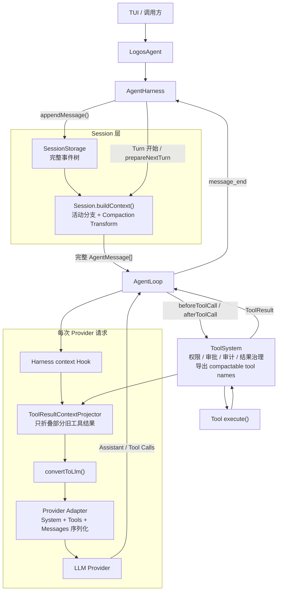
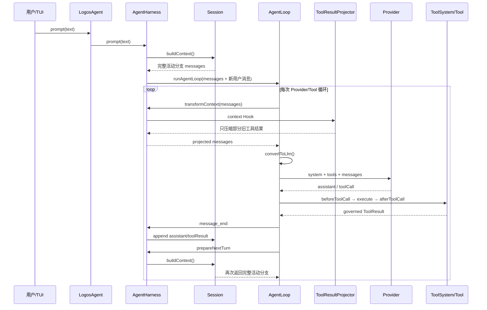
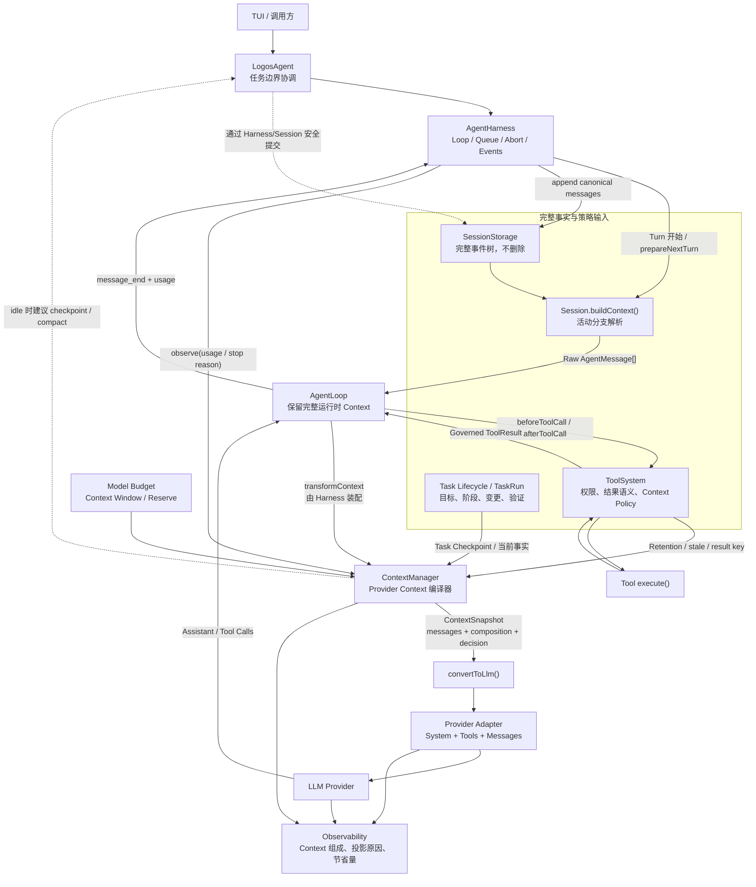
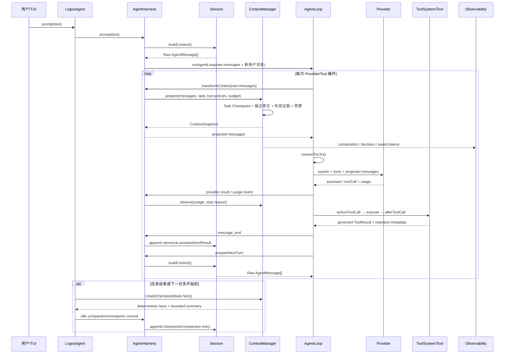

# Logos Agent Context 治理方法与设计

## 结论

Logos Agent 当前的主要瓶颈已经从“工具是否安全、模型是否会使用工具”迁移为“每次 Provider 请求都重复携带过大的历史 Context”。

这不是单纯的模型窗口溢出问题。当前 `deepseek-v4-pro` 的 Context Window 是 1,000,000 Token，最近一次完整开发任务的单轮 Context 约为 342,000–371,000 Token，只占窗口的 34%–37%，却因为同一 Turn 内发生了 35 次 Provider 请求，累计处理了 12,636,036 Token。

治理目标因此不能只写成“接近窗口时执行 Compaction”，而必须同时控制四件事：

1. 单次 Provider Context 的规模；
2. 一个任务中的 Provider 请求次数；
3. 历史证据的准确性和新鲜度；
4. Session 完整性与 Provider 工作集之间的分离。

## 三个不同概念

讨论 Context 时必须区分三层数据。

### Session History

完整保存用户消息、Assistant 消息、工具调用、工具结果、审批、审计和 Compaction Entry。它用于 UI 回放、恢复、分支和审计，不应为了节约模型 Token 而删除。

### Model Context

Agent 在某次 Provider 请求前，从 Session History 中选择并投影出来的工作集。它应该只包含当前任务所需的目标、约束、决策、近期原文和有效证据。

### Provider Payload

Model Context 再加上 System Prompt、Tool Schema 和 Provider 特定序列化之后的最终请求。Payload 才是网络上传输并由模型实际处理的数据。

这三层不能继续被同一个“Context Token”数字代替。

## 量化基线

最近一次任务是给面试练习加入“评测追问一键入库”闭环。Agent 先向用户确认入库方式，然后修改评测返回、前端展示、入库逻辑、样式和文档，并运行语法检查、服务启动与真实 Smoke Test。

### 链路数据

| 指标 | 实测值 |
|---|---:|
| 总耗时 | 480.40 秒 |
| 等待用户选择 | 122.10 秒 |
| 估算实际执行时间 | 358.30 秒 |
| Provider 请求 | 35 次 |
| 工具调用 | 35 次 |
| Span | 71 个 |
| 新输入 Token | 60,359 |
| 模型输出 Token | 17,597 |
| 其中 Reasoning Token | 11,560 |
| 缓存读取 Token | 12,558,080 |
| 累计处理 Token | **12,636,036** |
| 累计 Provider Payload | 45,683,535 bytes |
| Provider 总耗时 | 320.76 秒 |
| Trace 记录成本 | 约 `$0.0871` |

Provider 请求中的平均缓存读取量为约 358,802 Token。首轮请求处理约 342,280 Token 输入，其中 294,912 Token 来自缓存历史；最后一轮缓存历史增长到 370,688 Token。单轮 Payload 从 1,237,099 bytes 增长到 1,341,663 bytes。

### 真正属于本次任务的新信息比例

如果把新输入和输出视为本次链路中新产生或新增的信息：

```text
(60,359 + 17,597) / 12,636,036 ≈ 0.62%
```

其余约 99.38% 是 Provider 报告的缓存历史重复读取。缓存降低了当前价格模型下的费用，但没有消除请求次数、网络 Payload、Provider 等待时间和注意力竞争。

### 延迟影响

除去等待用户选择的时间，任务实际执行约 358.30 秒；Provider 请求累计占 320.76 秒：

```text
320.76 / 358.30 ≈ 89.5%
```

这个比例不能全部归因于 Context，因为 Provider 时间还包含 Reasoning 和输出生成；但它证明当前任务的主要等待发生在模型循环，不在本地工具执行。

### 质量风险代理指标

这条链只在当前 Turn 读取了 `app.js`，却修改了六个文件：

```text
app.js
proxy.mjs
style.css
README.md
package.json
kill-port.mjs
```

也就是说，六个被修改文件中只有一个在当前任务重新读取。模型在很大程度上依赖 Session 中的旧内容和既有假设，而不是重新取得当前源码证据。

端口冲突后新增 `kill-port.mjs` 和 `npm run killport` 也超出了用户要求的题库闭环范围。这不能只凭一条 Trace 证明是大 Context 直接导致，但它是陈旧信息、历史方案和当前目标开始争夺模型注意力的可量化风险信号。

## 与 8 月初基线的比较

8 月初的高优先级 TUI 任务耗时 13 分 41 秒，调用 Provider 96 次、工具 99 次，累计处理 13,134,945 Token。当前链路的执行控制已经明显改善，但 Context 效率几乎没有变化。

| 指标 | 8 月初 | 当前 | 变化 |
|---|---:|---:|---:|
| 总耗时 | 820.72 秒 | 480.40 秒 | 降低约 42% |
| Provider 请求 | 96 | 35 | 降低约 64% |
| 工具调用 | 99 | 35 | 降低约 65% |
| Span | 196 | 71 | 降低约 64% |
| 明确错误 | 8 | 2 | 降低 75% |
| 新输入与输出 | 105,569 | 77,956 | 降低约 26% |
| 累计处理 Token | 13,134,945 | 12,636,036 | **只降低约 3.8%** |
| Provider Payload 总量 | 48.39 MB | 45.68 MB | 只降低约 5.6% |

8 月初的问题可以概括为：

```text
很多 Provider 请求 × 中等大小 Context
```

当前问题变成：

```text
较少 Provider 请求 × 巨大 Session Context
```

工具 Interface、失败恢复、测试闭环和完成退出已经产生效果；长期 Session 的工作集治理没有同步完成，因此总体 Token 仍停留在同一量级。

## 当前实现的准确位置

### Session 默认保留完整活动分支

`Session.buildContext()` 通过当前叶节点构建活动分支。只有 Session 中存在 Compaction Entry 时，默认 Context Transform 才会用摘要和保留尾部替换旧历史。完整历史仍可通过 Full Branch 恢复。

### Harness 在工具循环中反复重建 Context

`AgentHarness` 在每个 Next Turn 前刷新 Session，并重新调用 `Session.buildContext()`。这保证新消息和工具结果及时进入模型，也意味着没有被投影掉的旧历史会在每个 Provider 请求中再次出现。

### 现有 Context Hook 只治理工具结果

Logos Agent 在 Harness 的 `context` Hook 中使用确定性的 Tool Result Projector：默认总预算 128 KiB，至少保留最近两个可压缩结果，旧结果替换为工具名、状态、原始大小、结构化事实和首行摘要。

这已经解决了一部分 Read、Grep、Git、Command 和 CodeGraph 大结果的重复搬运，但没有治理：

- 历史用户任务；
- Assistant 的长分析和长方案；
- 已完成任务的 Plan、Reflection 与最终回答；
- 已消费的 Edit Proposal 和 Apply 结果；
- 过期文件证据；
- 跨任务累积的工作记忆。

### 当前 Compaction 主要防止溢出

Logos Agent 只通过 `/compact` 显式执行 Harness Compaction。普通 `/compact` 在 Context 达到模型窗口的 70% 后运行，`/compact --force` 可以提前运行。

原始消息不会删除，摘要通过 `compaction_update` 动态显示，用户可以在提交前中断，也可以在没有产生新模型消息时恢复 Compaction 前的 Session 分支。

这套机制保证了可恢复性，但触发策略仍以“窗口是否快满”为中心。当前链路只有 34%–37%，不会自然触发，却已经产生了 1,263 万累计 Token。

## 根因模型

累计处理量由两个变量相乘：

```text
累计处理 Token ≈ Σ(每轮 Provider Context + 本轮新输入 + 本轮输出)
```

因此必须同时优化：

```text
Provider 请求次数
        ×
每次 Provider Context 大小
```

只减少工具调用，巨大历史仍会重复；只压缩历史，细粒度的 Tool/Provider 往返仍会放大成本。

## ContextManager 在 Agent Loop 中的定位

ContextManager 不是新的 Agent Loop，也不负责调用模型、执行工具或保存 Session。它位于“完整 Session 被转换成某一次 Provider 工作集”的 seam 上，是一个 **Provider Context 编译器**：输入完整但未经裁剪的 Agent Message、当前任务状态、工具 Context Policy 和模型预算，输出本次请求应该看到的消息以及可观测快照。

它工作的准确时机是：

```text
Session.buildContext()
→ ContextManager.prepare()
→ convertToLlm()
→ Provider Adapter 序列化
→ Provider 请求
```

因此它早于 Provider 特定格式转换，晚于 Session Branch 解析。它不会直接修改 Provider JSON，也不会改变 Session 中保存的原始历史。

### 改造前：原始模块关系

当前实现没有独立 ContextManager。Context 责任分散在 Session、Harness、Logos Agent 的 Context Hook 和 ToolSystem 声明之间。



原始关系中有四个关键事实：

1. `Session.buildContext()` 负责从 Session Tree 得到活动分支，但除 Compaction 外基本保留整条历史；
2. Harness 把这份历史交给 AgentLoop，并在每个工具循环后的 `prepareNextTurn` 再构建一次；
3. Logos Agent 的 `context` Hook 只调用 Tool Result Projector，没有统一的任务、消息和预算治理；
4. ToolSystem 声明哪些工具结果可以压缩，但不决定整个 Provider 工作集。

对应源码锚点：

| 环节 | 当前实现 |
|---|---|
| Session 读取 | `packages/agent/src/harness/session/session.ts` 的 `Session.buildContext()` |
| Turn 初始 Context | `packages/agent/src/harness/agent-harness.ts` 的 `createTurnState()` |
| Harness Context seam | `AgentHarness.createLoopConfig()` 中的 `transformContext` |
| 每轮重建 | `AgentHarness.createLoopConfig()` 中的 `prepareNextTurn` |
| Provider 前转换 | `packages/agent/src/agent-loop.ts` 的 `streamAssistantResponse()` |
| 当前 Logos 投影 | `apps/logos-agent/src/logos-agent.ts` 的 `harness.on("context", ...)` |
| 工具结果投影 | `apps/logos-agent/src/context-manager.ts` 的 `ContextManager.prepare()` |
| 工具 Context 声明 | `apps/logos-agent/src/tool-system.ts` 的 `ToolResultContextPolicy` |

### 改造前：一次工具循环的真实时序



问题正发生在循环箭头上：每次工具结果进入 Session 后，下一轮又从完整活动分支开始。Tool Result Projector 可以减轻部分大输出，但历史用户消息、Assistant 长回答、旧任务状态和仍被 `preserve` 的编辑结果会继续重复进入 Provider。

### ContextManager 的职责和非职责

| ContextManager 负责 | ContextManager 不负责 |
|---|---|
| 选择当前 Provider 请求需要的 Agent Message | 调度 Agent Loop |
| 执行 Soft/Hard Budget | 调用或重试 Provider |
| 合并 Task Checkpoint、最近原文和有效证据 | Provider 特定 JSON 序列化 |
| 根据 Tool Contract 处理结果生命周期 | 工具权限、审批和执行 |
| 标记 stale、deduplicated、compacted evidence | 修改或删除完整 Session History |
| 生成 ContextSnapshot 和触发原因 | 判断任务是否业务完成 |
| 建议 idle 时 Checkpoint/Compaction | 在运行中自行写 Session |

它与其他 Module 的关系是：

- **Session** 是完整事实来源；ContextManager 只读取和投影；
- **ToolSystem** 管理单次工具安全与结果语义，并向 ContextManager 提供结果生命周期声明；
- **Task Lifecycle/TaskRun** 提供当前目标、阶段、修改和验证事实；
- **Harness** 在固定 seam 调用 ContextManager，并继续负责 Loop、队列、中断和事件；
- **Provider Adapter** 在 ContextManager 之后执行 `convertToLlm` 和最终序列化；
- **Observability** 读取 ContextSnapshot 和最终 Provider Usage，不反向控制 Context。

## 目标架构



按照深 Module 原则，应把 Context 选择、预算、压缩、证据失效和观测集中到一个 `ContextManager` Module。Harness 和 Logos Agent 调用方只需要理解一个小 Interface：

```typescript
interface ContextManager {
  prepare(input: ContextPreparationInput): ContextSnapshot;
  observe(result: ProviderTurnResult): void;
  createCheckpoint(input: TaskCheckpointInput): TaskCheckpoint;
}
```

三个方法分别对应三个时机：

- `prepare()`：每次 `convertToLlm()` 之前调用，是 Agent Loop 的必经路径；
- `observe()`：Provider 返回并产生 Usage 后调用，用于累计预算和更新 Evidence 生命周期；
- `createCheckpoint()`：任务结束或新任务开始前、Harness 处于 idle 时调用，不进入普通 Tool Loop。

外部 Interface 保持小而稳定。具体的裁剪顺序、Token 估算、过期规则、摘要格式和预算算法都属于 Module 内部实现。

第一阶段已经克制地落地 `prepare()`：它接管原有 Tool Result 投影，返回本次请求的 Messages、消息数量、Tool Result 字节变化、具体被替换的 Tool Call 和触发原因，并通过 `context_snapshot` 事件对外提供不含消息正文的摘要。`observe()`、Task Checkpoint、全消息预算和自动摘要仍属于后续阶段，没有在这一阶段提前引入。

Module 内部隐藏：

- Session Context 读取；
- 当前任务识别；
- 最近原文保留；
- Task Checkpoint；
- Tool Result 生命周期；
- Soft Budget 与 Hard Budget；
- Compaction/Fork 决策；
- Provider Context 组成统计。

删除这个 Module 后，上述复杂度会重新扩散到 Harness、ToolSystem、Prompt、TUI 和各个工具，说明这个 Module 具有实际深度，而不是简单转发层。

### 改造后：一次工具循环的时序



关键变化不是取消 `Session.buildContext()`，而是在它和 `convertToLlm()` 之间建立一个拥有完整责任的 Module。Agent Loop 仍然可以看到本轮工具结果，Session 仍然保存完整轨迹，Provider 不再默认看到整条历史。

### 改造前后关系对比

| 问题 | 改造前 | 改造后 |
|---|---|---|
| Provider Message 来源 | Session 活动分支，外加工具结果局部投影 | ContextManager 输出的受预算工作集 |
| 历史用户/Assistant 消息 | 默认全部保留到手动 Compaction | 旧任务进入 Task Checkpoint，近期原文按预算保留 |
| 工具结果治理 | ToolResultProjector 按工具名单和 128 KiB 总预算 | ToolSystem 声明生命周期，ContextManager 统一执行 |
| 文件证据新鲜度 | 旧 Read 文本继续留在历史 | 文件修改后旧证据标记 stale，只留锚点和 Hash |
| Proposal 生命周期 | `preserve`，Apply 后仍保留完整结果 | 未消费时保留，Apply/拒绝后收敛为状态摘要 |
| Token 决策 | `/compact` 主要看窗口 70% | Hard Budget 防溢出，Soft Budget 控制循环放大 |
| Task 边界 | 多个任务连续堆在一个 Session Context | 完整 Session 不变，任务结束生成 Checkpoint |
| Harness 职责 | Loop + Context Hook，但策略由外部零散拼接 | Loop 不变，只在稳定 seam 调用 ContextManager |
| Observability | Session Context 与 Provider Context 容易混淆 | 每轮记录 Raw、Projected、Provider 三阶段组成 |

## Context 的四层结构

### 第一层：完整 Session

永久保存完整事件树。它是审计和恢复事实，不直接等于 Provider Context。

### 第二层：Task Checkpoint

每个执行任务维护结构化状态：

```text
用户原始目标
确认过的约束与选择
当前计划和已完成步骤
关键设计决策
读取过的文件与符号锚点
已应用修改及当前 Hash
测试与命令证据
尚未解决的问题
```

`finish_task` 后生成最终 Checkpoint。下一个不相关任务默认使用该 Checkpoint 和近期对话，而不是携带上一任务的完整逐字轨迹。

Checkpoint 不能只依赖模型自由摘要。用户原始目标、文件操作、工具状态和验证结果应由运行时确定性生成；模型只补充无法机械表达的决策理由。

### 第三层：最近逐字消息

保留当前局部推理真正需要的最近消息。初始目标可设为约 20k–40k Token，并根据任务阶段和模型能力调整。

### 第四层：按需证据

旧源码、旧命令日志和旧 Diff 默认不随请求发送。模型需要精确事实时，通过 Read、Grep、CodeGraph、Git 或 Command 工具重新取得当前证据。

## 双预算策略

### Hard Budget：容量安全

防止 Provider 拒绝请求：

```text
contextTokens > contextWindow - reserveTokens
```

这是现有 Compaction 已经覆盖的方向。

### Soft Budget：循环效率

控制尚未溢出但会被多次重复处理的 Context：

```text
projectedProcessedTokens = currentContextTokens × expectedRemainingProviderRequests
```

初始实验阈值可以设置为：

- 普通 Coding Task 的平均工作 Context 目标为 100k–150k Token；
- 单任务累计处理量达到 2M–3M Token 时产生警告或检查点；
- 已完成任务之后，如果下一条输入进入新任务，则在启动前自动生成 Task Checkpoint；
- Provider Context 超过 Soft Budget 时先执行确定性投影，再决定是否生成 LLM Summary；
- Hard Budget 负责强制安全，Soft Budget 负责成本与信息密度。

这些阈值是第一版实验值，必须通过同类型 Trace 的 P50/P95 数据校准，不能作为永不变化的常量。

## Tool Result 生命周期

ToolSystem 已经允许工具声明 `context.history` 和单次结果上限。下一步应把“是否压缩”扩展成结果生命周期，而不是继续按工具名添加分支。

| 结果类型 | Provider Context 生命周期 |
|---|---|
| `read_file` | 保留到相关文件发生修改；修改后标记为 stale，只留路径、行号和读取 Hash |
| Grep/List/Git Read | 保留关键锚点；旧原文按预算压缩 |
| CodeGraph | 第一次消费后保留符号、文件、关系、新鲜度和 Result Key |
| `propose_patch` | Proposal 未消费前保留；Apply 或拒绝后只留文件、Proposal ID、摘要和状态 |
| `apply_edit` | 保留文件、前后 Hash、修改摘要；完整 Diff 留在 Session/Git |
| 成功测试 | 保留命令、Exit Code、关键通过证据和运行时间 |
| 失败测试 | 在问题解决前保留关键错误；修复验证后压缩为“失败→修复→通过”证据 |
| 重复查询 | 按规范化参数和结果 Hash 去重，Provider Context 使用已有 Result Key |

完整结果继续留在 Session 和 Observability。ContextManager 只改变 Provider 工作集，不改变审计历史。

## 减少 Provider 请求次数

最近链路包含十次 `propose_patch` 和十次 `apply_edit`。Proposal/Apply 分离具有审批价值，但模型可以使用 Provider 原生的并行 Tool Call：

```text
集中读取相关文件
→ 一次响应提出一组相互独立的 Proposal
→ TUI 分组审批
→ 下一次响应应用已批准 Proposal
→ 一次集中验证
```

第一阶段不需要发明新的 Batch Tool。应先通过提示词、工具描述和审批 UI 允许模型充分使用原生并行调用，避免一个文件产生两次以上不必要的 Provider 决策。

## 是否需要修改 Harness

第一阶段不需要大改 Harness。现有 `context` Hook 已经是 Provider Context 的可替换 seam，可以接入 `ContextManager` 的确定性投影。

可以先在 Harness 外完成：

- 新任务开始前的自动 Checkpoint/Compact；
- 工具结果生命周期；
- 最近消息和旧任务投影；
- Provider Context 预算与观测；
- 并行工具调用规范。

只有当系统需要在一个正在执行的 Turn 内，两次 Provider 请求之间生成并持久化 LLM Compaction 时，才需要扩展 Harness。原因是当前 `AgentHarness.compact()` 要求 Harness 处于 idle 状态。即使扩展，Context 策略仍应属于 ContextManager，Harness 只提供安全提交时机，不承担业务判断。

## Compaction 交互原则

自动 Compaction 不需要额外审批，前提是：

- 完整 Session 不删除；
- TUI 动态展示正在生成的摘要；
- 提交前可以使用 `AbortSignal` 取消；
- 提交后明确显示 Context 前后规模；
- 在没有新模型消息时可以恢复 Compaction 前分支；
- Observability 记录触发原因、保留内容、节省 Token 和是否自动触发。

审批用于不可逆副作用；可恢复的 Model Context 投影属于运行时治理，不应再增加一次用户确认。

## 可观测指标

每个 Provider 请求至少记录：

```text
systemPromptTokens
toolSchemaTokens
sessionMessageTokens
taskCheckpointTokens
recentVerbatimTokens
toolEvidenceTokens
freshInputTokens
cacheReadTokens
cacheWriteTokens
outputTokens
processedTotalTokens
payloadBytes
providerLatencyMs
contextProjectionReason
compactionSavedTokens
```

每个根 Turn 汇总：

```text
providerRequestCount
toolCallCount
toolErrorCount
processedTotalTokens
cacheReadRatio
payloadBytesTotal
contextTokensFirst
contextTokensPeak
contextTokensLast
contextGrowthRatio
unrelatedMutationCount
currentSourceReadCoverage
```

Phoenix 列表不能再只展示 `prompt + completion`。最近链路的 77,956 Token 会掩盖真实的 12,636,036 累计处理量。

内容采集仍需受脱敏和大小上限保护。指标可以默认采集，完整 Prompt 和工具内容只能在本机显式开启。

## 量化优化目标

假设 Provider 请求仍保持 35 次，并把平均 Provider Context 控制在不同规模，粗略估算如下：

| 平均 Context 目标 | 预计累计处理量 | 相比当前下降 |
|---:|---:|---:|
| 150k | 约 5.33M | 约 58% |
| 100k | 约 3.58M | 约 72% |
| 50k | 约 1.83M | 约 86% |

如果同时把 Provider 请求从 35 次降到约 15 次，并把平均 Context 控制在 100k，预计处理量约为 1.53M，相比当前下降约 88%。

这是容量估算，不是已经实现的结果。任何优化必须同时满足：

- 用户目标和约束没有丢失；
- 当前源码仍是最终事实；
- 必要测试继续执行；
- 权限和审批范围不放宽；
- 完整 Session 可恢复；
- 最终结果质量不低于基线。

## 实施顺序

### P0：让数据说真话

1. Phoenix/TUI 同时展示 Fresh、Cache Read、Output 和 Processed Total；
2. 展示 Provider Context 的组成而非只有 Session 估算；
3. 记录首轮、峰值、末轮 Context 和累计 Payload；
4. 为当前链路固化回放基线。

### P1：任务边界与 Soft Budget

1. 在 `finish_task` 时生成结构化 Task Checkpoint；
2. 新任务开始前根据 Soft Budget 投影旧任务；
3. 保留最近逐字消息和完整 Session；
4. TUI 显示自动投影或 Compaction 原因及节省量。

### P2：工具证据生命周期

1. Apply 后压缩 Proposal；
2. 文件修改后使旧 Read 证据失效；
3. 测试从原始日志收敛为结构化证据；
4. 相同查询使用 Result Key 去重；
5. 为每种 Tool Contract 增加 Context 生命周期合规测试。

### P3：减少模型往返

1. 鼓励原生并行 Tool Call；
2. TUI 支持一组 Proposal 的集中审批；
3. 统计每个业务动作产生的 Provider 往返；
4. 对重复失败和无信息增益调用建立 Eval，而不是简单设置硬循环上限。

### P4：评估 Harness 内 Compaction

只有 P0–P3 仍无法控制长 Turn 时，才为 Harness 增加执行中安全 Compaction Checkpoint。该能力必须通过同一个 ContextManager Interface 使用，不能把策略散进 AgentLoop。

## 验收方法

使用同类 Coding Task 做 A/B 重放，至少收集 20 条 Trace，比较 P50 和 P95：

| 指标 | 当前基线 | 第一阶段目标 |
|---|---:|---:|
| 平均 Provider Context | 约 359k | 不超过 150k |
| Provider 请求 | 35 | 不超过 20，目标 15 |
| 累计处理 Token | 12.64M | 不超过 3M |
| Payload 总量 | 45.68 MB | 降低至少 60% |
| 当前源码读取覆盖 | 1/6 | 所有被修改文件有当前证据 |
| 任务外永久修改 | 1 个新增工具脚本 | 0 |
| 真实 Smoke Test | 通过 | 继续通过 |
| 完整 Session | 可恢复 | 继续可恢复 |
| 权限边界 | 未绕过 | 保持不变 |

不能只用 Token 下降判定成功。若优化通过删除必要源码、测试证据或用户约束实现，则属于质量退化，不是 Context 治理。

## 最终原则

1. Session 是完整事实，Provider Context 是受预算的工作集，两者必须分离。
2. Context 大小必须和 Provider 循环次数一起评估。
3. 缓存降低价格，不等于消除处理、延迟和注意力成本。
4. 压缩应优先删除重复和过期证据，不删除当前任务所需事实。
5. 工具自己声明结果生命周期，ContextManager 统一执行。
6. 当前源码、真实 Exit Code 和用户原始目标不能只依赖模型摘要。
7. 先使用现有 Harness seam，只有执行中持久化 Compaction 确有需要时才修改 Harness。
8. 所有优化都必须通过同类型 Trace 重放证明，而不是只凭实现推断有效。
