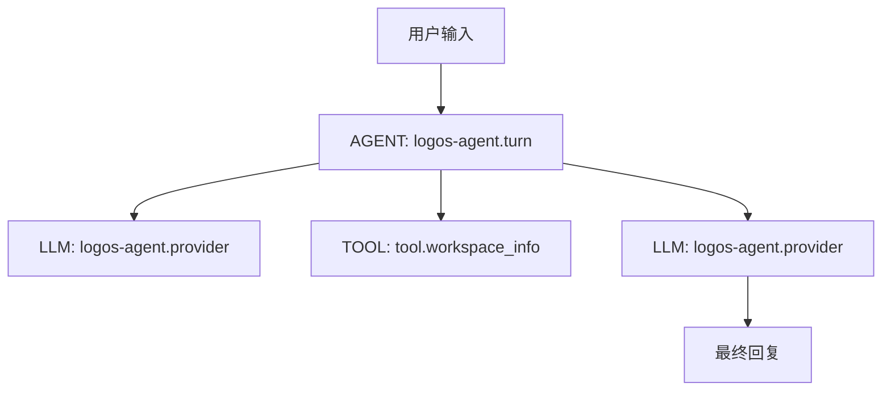

# Logos Agent 可观测性

Logos Agent 使用本机部署的 [Arize Phoenix](https://arize.com/docs/phoenix) 接收 OpenTelemetry/OTLP trace。项目名为 `logos-agent`，数据持久化在 `apps/logos-agent/.data/observability/phoenix-data`。

## 本机端点

- UI：<http://127.0.0.1:6006>
- OTLP/HTTP：<http://127.0.0.1:6006/v1/traces>
- OTLP/gRPC：`127.0.0.1:4317`

## Trace 结构



一次 `prompt()` 产生一个 AGENT 根 span。Agent loop 中每次 Provider 请求产生一个 LLM 子 span，每个工具调用产生一个 TOOL 子 span。LLM span 包含模型、Provider、HTTP 状态、stop reason、token、缓存 token 和成本；TOOL span 包含工具名、调用 ID、结果状态及耗时。

## Token 口径

分析 Agent Loop 成本时，不能只读取 Trace 列表中的 prompt 与 completion 汇总。完整处理量应使用：

```text
processed total = fresh input + cache read + cache write + output
```

其中：

- `fresh input` 是本次没有从 Provider Cache 读取的新输入；
- `cache read` 是每轮重新使用的缓存 Context；
- `output` 包含最终文本、工具调用和 Provider 报告的 Reasoning 用量；
- `processed total` 才适合比较一个多轮 Agent Task 的实际 Context 放大量。

缓存读取价格通常低于新输入，但它仍会反映同一历史在多个 Provider 请求中被重复处理。评估 Context 优化时应同时比较 Provider 请求数、首轮/峰值/末轮 Context、累计 Payload、Provider 耗时与 Processed Total。

完整方法和当前量化基线见 [`context-governance.md`](./context-governance.md)。

## 管理 Phoenix

在 `apps/logos-agent` 中运行：

```powershell
npm run observability:install
npm run observability:start
npm run observability:status
npm run observability:stop
```

首次安装固定使用 `arize-phoenix==19.13.0`，安装到独立 Python venv，不修改系统 Python 包。

## Agent 配置

```powershell
$env:LOGOS_AGENT_OBSERVABILITY_ENDPOINT="http://127.0.0.1:6006"
$env:LOGOS_AGENT_OBSERVABILITY_PROJECT="logos-agent"
$env:LOGOS_AGENT_OBSERVABILITY_CAPTURE_CONTENT="true"
logos-agent
```

当前电脑还把以上配置持久化在 `apps/logos-agent/.data/logos-agent.env`。全局
`logos-agent` 命令每次启动都会自动加载该文件，因此不依赖终端刷新用户级环境变量。
显式设置的进程环境变量优先级更高；未设置 endpoint 时，可观测模块为 no-op，Agent 正常运行。

`LOGOS_AGENT_OBSERVABILITY_CAPTURE_CONTENT=true` 会把用户输入、最终 Provider payload、模型输出、工具参数和经现有安全管道脱敏后的工具结果发送到本机 Phoenix。模块还会按字段名二次遮盖 API key、Authorization、Cookie、密码、Secret 和认证 token，并把单字段限制为 32,000 字符。若只需要指标和结构，将其设为 `false`。

## UI 查看方法

1. 打开 <http://127.0.0.1:6006>。
2. 进入 `logos-agent` 项目并打开 Traces。
3. 选择 `logos-agent.turn`，查看 AGENT 根 span 及其 LLM/TOOL 子 span。
4. 在 LLM span 的 Attributes 中查看 `llm.model_name`、`llm.token_count.*`、`input.value` 和 `llm.output_messages.*`。
5. 在 TOOL span 中查看 `tool.name`、`logos_agent.tool_call_id` 和错误状态。

Phoenix 的 Playground WASM 预下载失败不会影响 trace 收集、存储或 UI 查看；它只影响 Playground 中的隔离代码执行功能。
